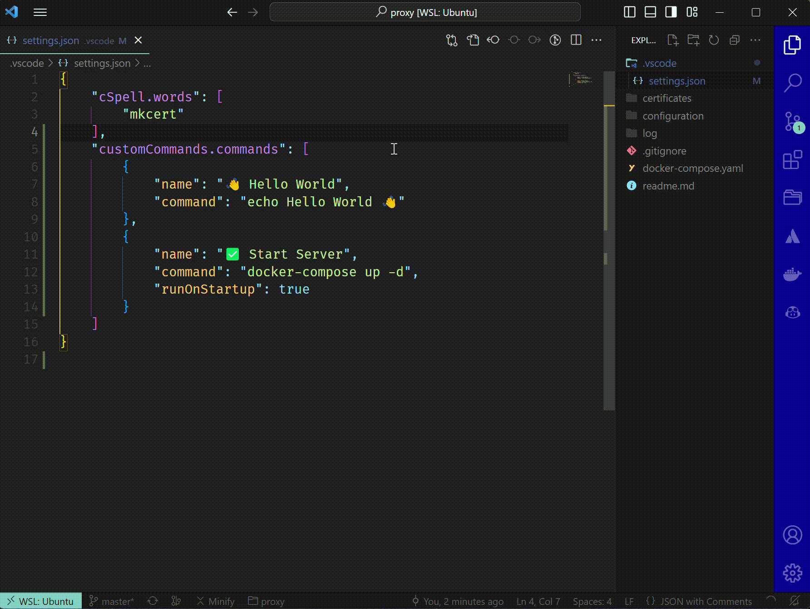

# custom-commands README

Adds one command to the Command Palate (Ctrl/Cmd + Shift + P) called "Custom Commands: Run... which lists out your commands you define in your VS Code settings customCommands.commands, when you select one, it runs it.

Great for project level commands, like starting docker from a specific docker-compose file, or running a specific npm script.

## Usage

## Release Notes

### 0.0.3
Added command.runOnStartup and command.runOnShutdown options
Added usage example to readme

### 0.0.4
Added VS Code variables to command arguments (e.g. ${selectedText}) so you now write a command like `ping ${selectedText}` - thanks @vince1024 for the idea/request!

**Enjoy!**
